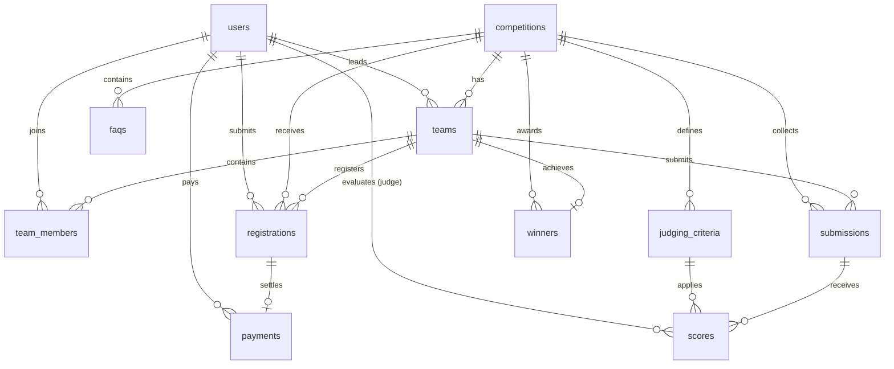

# Database Architecture & Schema — HIMATIF IT Competition

## 1. Database Specifications

* **Engine:** MySQL 8.x / MariaDB
* **Character Set:** `utf8mb4`
* **Collation:** `utf8mb4_unicode_ci`
* **Connection Name:** `mysql`
* **Port:** `3306`

---

## 2. Entity Relationship Model (ERD)



---

## 3. Entities & Schema Details

### 1. `users`
Tabel akun autentikasi untuk seluruh pengguna (panitia, juri, dan peserta).

| Column | Type | Nullable | Description |
| :--- | :--- | :--- | :--- |
| `id` | BIGINT UNSIGNED | No | Primary Key (Auto Increment) |
| `name` | VARCHAR(255) | No | Nama lengkap pengguna |
| `email` | VARCHAR(255) | No | Alamat email unik (Index) |
| `role` | VARCHAR(50) | No | Peran pengguna: `participant`, `admin`, `judge` |
| `phone` | VARCHAR(20) | Yes | Nomor WhatsApp aktif |
| `education_level` | VARCHAR(50) | Yes | Tingkat pendidikan (`mahasiswa` / `siswa`) |
| `institution` | VARCHAR(255) | Yes | Asal sekolah / perguruan tinggi |
| `city` | VARCHAR(100) | Yes | Kota / Kabupaten domisili di Ciayumajakuning |
| `avatar_url` | VARCHAR(255) | Yes | URL foto profil |
| `email_verified_at` | TIMESTAMP | Yes | Waktu verifikasi email |
| `password` | VARCHAR(255) | No | Hash password (Bcrypt) |
| `created_at` / `updated_at` | TIMESTAMP | Yes | Timestamps bawaan Eloquent |

### 2. `competitions`
Cabang lomba yang diselenggarakan dengan manajemen lifecycle terstruktur.

| Column | Type | Nullable | Description |
| :--- | :--- | :--- | :--- |
| `id` | BIGINT UNSIGNED | No | Primary Key |
| `name` | VARCHAR(255) | No | Nama lomba (UI/UX, Web Dev, LKTI, Poster) |
| `slug` | VARCHAR(255) | No | URL-friendly slug unik (Unique Index) |
| `competition_type` | VARCHAR(50) | No | Format lomba: `team`, `individual` (default: `team`) |
| `category` | VARCHAR(50) | No | Kategori lomba: `ui_ux`, `web_development`, `lkti`, `poster` (Index) |
| `description` | TEXT | No | Deskripsi lengkap kompetisi |
| `theme` | VARCHAR(255) | Yes | Tema perlombaan |
| `target_level` | VARCHAR(50) | No | Jenjang sasaran: `university`, `high_school` (Index) |
| `registration_fee` | BIGINT UNSIGNED | No | Biaya registrasi (IDR, default: 0) |
| `quota` | INT UNSIGNED | No | Kuota maksimal tim/peserta (default: 50) |
| `min_team_member` | TINYINT UNSIGNED | No | Batas minimum anggota tim (min: 1) |
| `max_team_member` | TINYINT UNSIGNED | No | Batas maksimum anggota tim (>= min) |
| `registration_start` | TIMESTAMP | Yes | Waktu mulai pendaftaran (Index) |
| `registration_end` | TIMESTAMP | Yes | Batas akhir pendaftaran (Index) |
| `submission_start` | TIMESTAMP | Yes | Waktu mulai pengumpulan karya |
| `submission_deadline`| TIMESTAMP | Yes | Batas akhir pengumpulan karya |
| `status` | VARCHAR(50) | No | Lifecycle status: `draft`, `registration_open`, `registration_closed`, `submission_open`, `judging`, `finished`, `archived` (Index) |
| `is_published` | BOOLEAN | No | Status publikasi publik: `true` / `false` (Index) |
| `guidebook_url` | VARCHAR(255) | Yes | Tautan berkas panduan teknis PDF |
| `poster_url` | VARCHAR(255) | Yes | Tautan gambar banner visual lomba |
| `created_at` / `updated_at` | TIMESTAMP | Yes | Timestamps bawaan Eloquent |

### 3. `teams`
Tim peserta yang mengikuti kompetisi beregu.

| Column | Type | Nullable | Description |
| :--- | :--- | :--- | :--- |
| `id` | BIGINT UNSIGNED | No | Primary Key |
| `competition_id` | BIGINT UNSIGNED | No | FK -> `competitions.id` (Cascade On Delete) |
| `leader_id` | BIGINT UNSIGNED | No | FK -> `users.id` (Cascade On Delete) |
| `name` | VARCHAR(255) | No | Nama tim (Unique per competition) |
| `code` | VARCHAR(20) | No | Kode unik undangan tim e.g. `HITC-XXXXX` (Unique Index) |
| `institution` | VARCHAR(255) | No | Nama instansi perwakilan tim |
| `created_at` / `updated_at` | TIMESTAMP | Yes | Timestamps bawaan Eloquent |

*Unique constraint:* `['competition_id', 'name']`, `['code']`.

### 4. `team_members`
Daftar seluruh anggota di dalam tim (termasuk ketua tim).

| Column | Type | Nullable | Description |
| :--- | :--- | :--- | :--- |
| `id` | BIGINT UNSIGNED | No | Primary Key |
| `team_id` | BIGINT UNSIGNED | No | FK -> `teams.id` (Cascade On Delete) |
| `user_id` | BIGINT UNSIGNED | No | FK -> `users.id` (Cascade On Delete) |
| `role` | VARCHAR(50) | No | Peran dalam tim: `leader`, `member` |
| `joined_at` | TIMESTAMP | Yes | Waktu bergabung ke tim |
| `created_at` / `updated_at` | TIMESTAMP | Yes | Timestamps bawaan Eloquent |

*Unique constraint:* `['team_id', 'user_id']`.

### 5. `registrations`
Pendaftaran resmi peserta/tim ke dalam cabang kompetisi.

| Column | Type | Nullable | Description |
| :--- | :--- | :--- | :--- |
| `id` | BIGINT UNSIGNED | No | Primary Key |
| `registration_number`| VARCHAR(40) | No | Nomor registrasi unik terformat e.g. `ITC-2026-XXXXX` (Unique Index) |
| `competition_id` | BIGINT UNSIGNED | No | FK -> `competitions.id` |
| `team_id` | BIGINT UNSIGNED | Yes | FK -> `teams.id` (NULL untuk lomba individu) |
| `user_id` | BIGINT UNSIGNED | No | FK -> `users.id` (Pendaftar / Ketua Tim) |
| `status` | VARCHAR(50) | No | Status pendaftaran: `draft`, `submitted`, `under_review`, `revision_required`, `approved`, `rejected`, `cancelled` |
| `submitted_at` | TIMESTAMP | Yes | Waktu submit pendaftaran |
| `reviewed_at` | TIMESTAMP | Yes | Waktu verifikasi oleh panitia |
| `reviewed_by` | BIGINT UNSIGNED | Yes | FK -> `users.id` (Admin verifikator) |
| `revision_note` | TEXT | Yes | Catatan perbaikan dari panitia saat status `revision_required` |
| `rejection_reason` | TEXT | Yes | Alasan penolakan dari panitia saat status `rejected` |
| `created_at` / `updated_at` | TIMESTAMP | Yes | Timestamps bawaan Eloquent |

*Unique constraint:* `['competition_id', 'user_id']`, `['registration_number']`.

### 6. `payments`
Pencatatan bukti pembayaran biaya registrasi lomba manual bank transfer dengan verifikasi panitia.

| Column | Type | Nullable | Description |
| :--- | :--- | :--- | :--- |
| `id` | BIGINT UNSIGNED | No | Primary Key |
| `registration_id` | BIGINT UNSIGNED | No | FK -> `registrations.id` (Unique Index, Cascade On Delete) |
| `user_id` | BIGINT UNSIGNED | No | FK -> `users.id` |
| `amount` | BIGINT UNSIGNED | No | Nominal tagihan otomatis dari `competition.registration_fee` (IDR) |
| `payment_method` | VARCHAR(100) | No | Metode pembayaran (default: Transfer Bank BCA) |
| `status` | VARCHAR(50) | No | Enum: `pending`, `submitted`, `under_review`, `approved`, `rejected`, `cancelled` (Index) |
| `proof_path` | VARCHAR(255) | Yes | Lokasi berkas bukti transfer di penyimpanan privat (`storage/app/private/`) |
| `transaction_reference` | VARCHAR(100) | Yes | Nomor referensi/mutasi transaksi bank dari peserta |
| `notes` | TEXT | Yes | Catatan tambahan peserta saat pembayaran |
| `rejection_reason` | TEXT | Yes | Alasan penolakan dari admin jika pembayaran ditolak |
| `submitted_at` | TIMESTAMP | Yes | Waktu peserta mengajukan verifikasi pembayaran |
| `reviewed_at` | TIMESTAMP | Yes | Waktu verifikasi oleh panitia |
| `reviewed_by` | BIGINT UNSIGNED | Yes | FK -> `users.id` (Admin pemverifikasi) |
| `created_at` / `updated_at` | TIMESTAMP | Yes | Timestamps bawaan Eloquent |

### 7. `submissions`
Pengumpulan karya peserta per nomor registrasi dengan validasi window batas waktu (deadline).

| Column | Type | Nullable | Description |
| :--- | :--- | :--- | :--- |
| `id` | BIGINT UNSIGNED | No | Primary Key |
| `registration_id` | BIGINT UNSIGNED | No | FK -> `registrations.id` (Unique Index, Cascade On Delete) |
| `competition_id` | BIGINT UNSIGNED | No | FK -> `competitions.id` (Cascade On Delete) |
| `team_id` | BIGINT UNSIGNED | Yes | FK -> `teams.id` (Set NULL On Delete, untuk lomba beregu) |
| `title` | VARCHAR(255) | No | Judul karya / proyek yang diajukan |
| `description` | TEXT | Yes | Abstrak / deskripsi teknis solusi karya |
| `status` | VARCHAR(50) | No | Enum: `draft`, `submitted`, `locked`, `withdrawn` (Index) |
| `submitted_at` | TIMESTAMP | Yes | Waktu pengiriman / submit final karya |
| `created_at` / `updated_at` | TIMESTAMP | Yes | Timestamps bawaan Eloquent |

### 8. `submission_files`
Berkas lampiran digital karya (proposal PDF, source code ZIP/RAR, materi presentasi PPTX).

| Column | Type | Nullable | Description |
| :--- | :--- | :--- | :--- |
| `id` | BIGINT UNSIGNED | No | Primary Key |
| `submission_id` | BIGINT UNSIGNED | No | FK -> `submissions.id` (Cascade On Delete) |
| `original_name` | VARCHAR(255) | No | Nama asli berkas saat diunggah peserta |
| `stored_name` | VARCHAR(255) | No | Nama acak unik berkas di filesystem server |
| `mime_type` | VARCHAR(100) | Yes | Tipe MIME berkas (e.g. `application/pdf`, `application/zip`) |
| `size` | BIGINT UNSIGNED | No | Ukuran berkas dalam bytes (Maks 20MB) |
| `path` | VARCHAR(255) | No | Path absolut privat di storage lokal server |
| `created_at` / `updated_at` | TIMESTAMP | Yes | Timestamps bawaan Eloquent |

### 9. `judging_criteria` & `scores`
* **`judging_criteria`**: Kriteria penilaian setiap lomba (bobot total 100%).
* **`scores`**: Nilai yang diinput oleh juri untuk setiap karya dan kriteria.
  - Formula Nilai Akhir: `Final Score = Σ (Score * (Weight / 100))`

### 10. `announcements`, `faqs`, `sponsors`, `winners`
Tabel pendukung konten publik website (berita acara, tanya jawab, daftar sponsor, dan hall of fame juara).

---

## 4. Status Architecture (Lifecycle State Machines)

Sistem menggunakan enum independen untuk setiap domain agar tidak mencampurkan status bisnis yang berbeda:

### 1. `RegistrationStatus`
```text
DRAFT ──► SUBMITTED ──► UNDER_REVIEW ──► APPROVED
                             │
                             ├──────► REVISION_REQUIRED ──► SUBMITTED
                             ├──────► REJECTED
                             └──────► CANCELLED
```

### 2. `PaymentStatus`
```text
PENDING (Unpaid) ──► SUBMITTED / UNDER_REVIEW ──► APPROVED (Paid)
                            │
                            ├──────► REJECTED ──► SUBMITTED (Re-upload)
                            └──────► CANCELLED
```
*Note: Untuk kompetisi gratis (`registration_fee == 0`), pendaftaran yang disetujui langsung dinyatakan bebas biaya (`is_payment_cleared = true`).*

### 3. `SubmissionStatus`
```text
DRAFT ──► SUBMITTED (Resubmission allowed before deadline) ──► LOCKED (Past deadline)
              │
              └──────► WITHDRAWN
```

### 4. `JudgingStatus` (Phase 5)
```text
NOT_STARTED ──► IN_PROGRESS ──► COMPLETED
```
