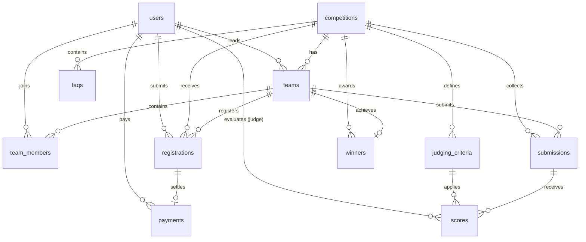

# Database Architecture & Schema — HIMATIF IT Competition

## 1. Database Specifications

* **Engine:** MySQL 8.x / MariaDB
* **Character Set:** `utf8mb4`
* **Collation:** `utf8mb4_unicode_ci`
* **Connection Name:** `mysql`
* **Port:** `3306`

---

## 2. Entity Relationship Model (ERD)



---

## 3. Entities & Schema Details

### 1. `users`
Tabel akun autentikasi untuk seluruh pengguna (panitia, juri, dan peserta).

| Column | Type | Nullable | Description |
| :--- | :--- | :--- | :--- |
| `id` | BIGINT UNSIGNED | No | Primary Key (Auto Increment) |
| `name` | VARCHAR(255) | No | Nama lengkap pengguna |
| `email` | VARCHAR(255) | No | Alamat email unik (Index) |
| `role` | VARCHAR(50) | No | Peran pengguna: `participant`, `admin`, `judge` |
| `phone` | VARCHAR(20) | Yes | Nomor WhatsApp aktif |
| `education_level` | VARCHAR(50) | Yes | Tingkat pendidikan (`mahasiswa` / `siswa`) |
| `institution` | VARCHAR(255) | Yes | Asal sekolah / perguruan tinggi |
| `city` | VARCHAR(100) | Yes | Kota / Kabupaten domisili di Ciayumajakuning |
| `avatar_url` | VARCHAR(255) | Yes | URL foto profil |
| `email_verified_at` | TIMESTAMP | Yes | Waktu verifikasi email |
| `password` | VARCHAR(255) | No | Hash password (Bcrypt) |
| `created_at` / `updated_at` | TIMESTAMP | Yes | Timestamps bawaan Eloquent |

### 2. `competitions`
Cabang lomba yang diselenggarakan dengan manajemen lifecycle terstruktur.

| Column | Type | Nullable | Description |
| :--- | :--- | :--- | :--- |
| `id` | BIGINT UNSIGNED | No | Primary Key |
| `name` | VARCHAR(255) | No | Nama lomba (UI/UX, Web Dev, LKTI, Poster) |
| `slug` | VARCHAR(255) | No | URL-friendly slug unik (Unique Index) |
| `category` | VARCHAR(50) | No | Kategori lomba: `ui_ux`, `web_development`, `lkti`, `poster` (Index) |
| `description` | TEXT | No | Deskripsi lengkap kompetisi |
| `theme` | VARCHAR(255) | Yes | Tema perlombaan |
| `target_level` | VARCHAR(50) | No | Jenjang sasaran: `university`, `high_school` (Index) |
| `registration_fee` | BIGINT UNSIGNED | No | Biaya registrasi (IDR, default: 0) |
| `quota` | INT UNSIGNED | No | Kuota maksimal tim/peserta (default: 50) |
| `min_team_member` | TINYINT UNSIGNED | No | Batas minimum anggota tim (min: 1) |
| `max_team_member` | TINYINT UNSIGNED | No | Batas maksimum anggota tim (>= min) |
| `registration_start` | TIMESTAMP | Yes | Waktu mulai pendaftaran (Index) |
| `registration_end` | TIMESTAMP | Yes | Batas akhir pendaftaran (Index) |
| `submission_start` | TIMESTAMP | Yes | Waktu mulai pengumpulan karya |
| `submission_deadline`| TIMESTAMP | Yes | Batas akhir pengumpulan karya |
| `status` | VARCHAR(50) | No | Lifecycle status: `draft`, `registration_open`, `registration_closed`, `submission_open`, `judging`, `finished`, `archived` (Index) |
| `is_published` | BOOLEAN | No | Status publikasi publik: `true` / `false` (Index) |
| `guidebook_url` | VARCHAR(255) | Yes | Tautan berkas panduan teknis PDF |
| `poster_url` | VARCHAR(255) | Yes | Tautan gambar banner visual lomba |
| `created_at` / `updated_at` | TIMESTAMP | Yes | Timestamps bawaan Eloquent |

### 3. `teams`
Tim peserta yang mengikuti kompetisi.

| Column | Type | Nullable | Description |
| :--- | :--- | :--- | :--- |
| `id` | BIGINT UNSIGNED | No | Primary Key |
| `competition_id` | BIGINT UNSIGNED | No | FK -> `competitions.id` (Cascade On Delete) |
| `leader_id` | BIGINT UNSIGNED | No | FK -> `users.id` (Cascade On Delete) |
| `name` | VARCHAR(255) | No | Nama tim |
| `code` | VARCHAR(20) | No | Kode unik tim (Unique Index) |
| `institution` | VARCHAR(255) | No | Nama instansi perwakilan tim |
| `status` | VARCHAR(50) | No | Status tim (default: `ACTIVE`) |

### 4. `team_members`
Anggota tim selain ketua.

| Column | Type | Nullable | Description |
| :--- | :--- | :--- | :--- |
| `id` | BIGINT UNSIGNED | No | Primary Key |
| `team_id` | BIGINT UNSIGNED | No | FK -> `teams.id` (Cascade On Delete) |
| `user_id` | BIGINT UNSIGNED | Yes | FK -> `users.id` (jika punya akun) |
| `name` | VARCHAR(255) | No | Nama anggota |
| `email` | VARCHAR(255) | Yes | Email anggota |
| `phone` | VARCHAR(20) | Yes | Nomor WhatsApp anggota |
| `role` | VARCHAR(50) | No | Peran dalam tim (`LEADER` / `MEMBER`) |
| `status` | VARCHAR(50) | No | Status keanggotaan (default: `INVITED`) |

### 5. `registrations`
Pendaftaran resmi tim ke dalam cabang kompetisi.

| Column | Type | Nullable | Description |
| :--- | :--- | :--- | :--- |
| `id` | BIGINT UNSIGNED | No | Primary Key |
| `registration_number`| VARCHAR(40) | No | Nomor registrasi unik (Index) |
| `competition_id` | BIGINT UNSIGNED | No | FK -> `competitions.id` |
| `team_id` | BIGINT UNSIGNED | No | FK -> `teams.id` |
| `user_id` | BIGINT UNSIGNED | No | FK -> `users.id` (Pendaftar) |
| `status` | VARCHAR(50) | No | Status pendaftaran (RegistrationStatus Enum) |
| `notes` | TEXT | Yes | Catatan panitia verifikator |
| `verified_at` | TIMESTAMP | Yes | Waktu verifikasi administrasi |
| `verified_by` | BIGINT UNSIGNED | Yes | FK -> `users.id` (Admin pemverifikasi) |

### 6. `payments`
Pencatatan bukti pembayaran biaya registrasi lomba.

| Column | Type | Nullable | Description |
| :--- | :--- | :--- | :--- |
| `id` | BIGINT UNSIGNED | No | Primary Key |
| `registration_id` | BIGINT UNSIGNED | No | FK -> `registrations.id` (Cascade On Delete) |
| `user_id` | BIGINT UNSIGNED | No | FK -> `users.id` |
| `amount` | BIGINT UNSIGNED | No | Nominal transfer (IDR) |
| `payment_method` | VARCHAR(100) | Yes | Metode pembayaran (e.g. Transfer BCA) |
| `proof_url` | VARCHAR(255) | Yes | Tautan bukti transfer |
| `status` | VARCHAR(50) | No | Status pembayaran (PaymentStatus Enum) |
| `notes` | TEXT | Yes | Catatan admin keuangan |
| `verified_at` | TIMESTAMP | Yes | Waktu verifikasi pembayaran |
| `verified_by` | BIGINT UNSIGNED | Yes | FK -> `users.id` (Admin pemverifikasi) |

### 7. `submissions`
Pengumpulan karya akhir peserta.

| Column | Type | Nullable | Description |
| :--- | :--- | :--- | :--- |
| `id` | BIGINT UNSIGNED | No | Primary Key |
| `competition_id` | BIGINT UNSIGNED | No | FK -> `competitions.id` |
| `team_id` | BIGINT UNSIGNED | No | FK -> `teams.id` |
| `title` | VARCHAR(255) | No | Judul karya |
| `description` | TEXT | Yes | Abstrak / deskripsi karya |
| `file_url` | VARCHAR(255) | Yes | Tautan berkas proposal/laporan (Drive / Cloud) |
| `demo_url` | VARCHAR(255) | Yes | Tautan demo aplikasi / desain Figma |
| `repository_url` | VARCHAR(255) | Yes | Tautan repositori source code GitHub |
| `status` | VARCHAR(50) | No | Status karya (SubmissionStatus Enum) |
| `notes` | TEXT | Yes | Catatan revisi atau komentar |
| `submitted_at` | TIMESTAMP | Yes | Waktu pengiriman karya |

### 8. `judging_criteria` & `scores`
* **`judging_criteria`**: Kriteria penilaian setiap lomba (bobot total 100%).
* **`scores`**: Nilai yang diinput oleh juri untuk setiap karya dan kriteria.
  - Formula Nilai Akhir: `Final Score = Σ (Score * (Weight / 100))`

### 9. `announcements`, `faqs`, `sponsors`, `winners`
Tabel pendukung konten publik website (berita acara, tanya jawab, daftar sponsor, dan hall of fame juara).

---

## 4. Status Architecture (Lifecycle State Machines)

Sistem menggunakan enum independen untuk setiap domain agar tidak mencampurkan status bisnis yang berbeda:

### 1. `RegistrationStatus`
```text
DRAFT ──► SUBMITTED ──► IN_REVIEW ──► APPROVED
                             │
                             ├──────► REVISION_REQUIRED ──► SUBMITTED
                             ├──────► REJECTED
                             └──────► CANCELLED
```

### 2. `PaymentStatus`
```text
NOT_REQUIRED / UNPAID ──► WAITING_VERIFICATION ──► PAID
                                   │
                                   └─────────────► PAYMENT_REJECTED
```

### 3. `SubmissionStatus`
```text
NOT_OPEN ──► OPEN ──► SUBMITTED ──► UNDER_REVIEW ──► ACCEPTED / LOCKED
```

### 4. `JudgingStatus`
```text
NOT_STARTED ──► IN_PROGRESS ──► COMPLETED
```
